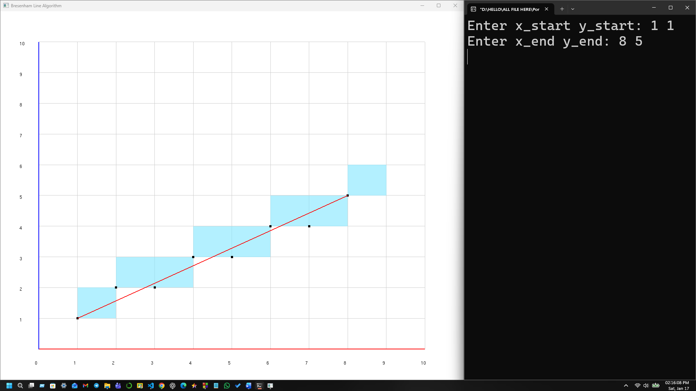

# Bresenham's Line Drawing Algorithm Visualization (OpenGL/GLUT)

This project demonstrates the **Bresenham's Line Drawing Algorithm** using **C and OpenGL (GLUT)**.  
It visually compares the **ideal mathematical line** against the **rasterized pixels** generated by the algorithm on a coordinate grid.

---

## 📌 Features

- **Grid Coordinate System:** Simulates a pixel grid (graph paper style).
- **Bresenham's Logic:** Efficiently calculates integer coordinates for line drawing.
- **Visual Comparison:**
  - **Blue Squares:** The discrete pixels selected by the algorithm.
  - **Red Line:** The actual "ideal" straight line (drawn for reference/accuracy check).
- **Universal Handling:** Works for all slopes ($m < 1$, $m \ge 1$, positive, and negative).

---

## 🧠 How It Works

Bresenham's algorithm determines which pixels on a raster grid best approximate a straight line between two points. It uses **integer arithmetic** (no floating point) to decide whether to increment the secondary coordinate, resulting in a highly efficient rendering process.

In the visualization:
1. The **Red Line** shows the perfect path (mathematical vector).
2. The **Blue Blocks** show the nearest integer points (pixels) approximating that path.

---

## 🛠️ Technologies Used

- **Language:** C  
- **Graphics Library:** OpenGL  
- **Toolkit:** GLUT (OpenGL Utility Toolkit)

---

## ▶️ How to Run

### 1️⃣ Prerequisites
Make sure you have a C compiler and OpenGL/GLUT libraries installed.

### 2️⃣ Compilation (Linux/Terminal)

```bash
gcc bresenham.c -lGL -lGLU -lglut -o bresenham
./bresenham
```

*(For Windows/CodeBlocks, ensure GLUT linker settings are configured properly)*

### 3️⃣ Input Format

The program will ask for start and end coordinates in the console:

```text
Enter x_start y_start:
Enter x_end y_end:
```

**Example Input:**
```text
Enter x_start y_start: 2 3
Enter x_end y_end: 15 10
```

---

## 📷 Sample Output




---
## 🖥️ Output Description

When the graphics window opens, you will see:

*   **Gray Grid:** Represents the screen pixels/coordinate system.
*   **Blue Filled Cells:** The pixels chosen by Bresenham's Algorithm.
*   **Black Dots:** The exact integer center points of the pixels.
*   **Red Line:** The true straight line connecting the start and end points (showing the ideal path vs. the pixelated path).

---

## 📚 Academic Use

This project is designed for **Computer Graphics** coursework to demonstrate:
* Line Rasterization techniques.
* The "Staircase Effect" (Aliasing) in digital graphics.
* The difference between an ideal line and a rasterized line.

---

## ✍️ Author

**Emamul Islam Nadid**  
BSc in Computer Science & Engineering

---

## 📄 License

This project is for **educational purposes**. Feel free to use and modify it for learning.
```

